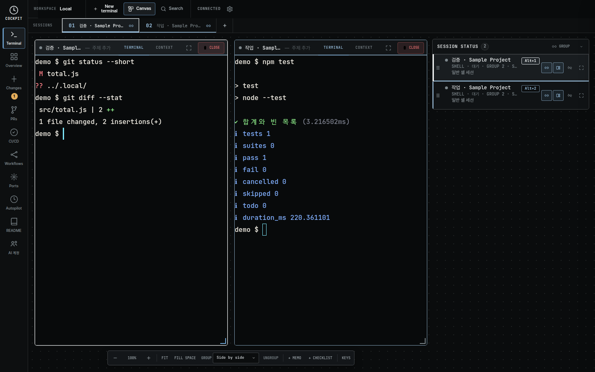
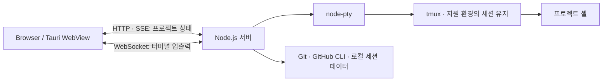

# Cockpit

**여러 프로젝트의 AI 코딩 세션과 터미널 작업을 한 화면에서 이어가는 로컬 개발 도구입니다.**

Claude Code·Codex·OpenCode로 여러 프로젝트를 작업할 때는 실행 중인 세션, 승인 대기, 수정한 파일과 CI 결과를 따로 확인해야 합니다. Cockpit은 터미널 캔버스, 에이전트 상태와 Git 작업을 연결해 **어디에 개입해야 하고 어떤 작업을 이어가야 하는지** 확인할 수 있게 합니다.

[시연 영상](docs/media/cockpit-demo.webm) · [설계 사례](#설계와-문제-해결) · [실행 방법](#실행) · [전체 기능·운영 가이드](docs/user-guide.md)

[](https://github.com/wooinwoo/claude-code-cockpit/actions/workflows/ci.yml)



> 2026-09-07 촬영. 격리된 샘플 프로젝트를 실제 Cockpit 서버·PTY·tmux·Chromium에서 실행했습니다. 화면의 테스트 결과는 샘플 프로젝트의 실행 결과이며, 실제 AI 서비스 호출이나 외부 CI 성공을 연출한 자료가 아닙니다. [촬영 조건과 재현](docs/media/README.md)

## 해결한 문제

| 작업 중 겪는 문제 | Cockpit의 처리 | 구현 근거 |
|---|---|---|
| 여러 터미널과 프로젝트를 오가며 작업 맥락을 놓친다. | 터미널을 캔버스에 배치하고 그룹·분할·순서를 유지한다. | [터미널 UI](js/terminal-ui.js), [그룹 레이아웃](js/terminal-group-layout.js) |
| 서버를 재시작하면 셸 작업과 화면 배치가 사라진다. | 지원 환경에서 tmux 세션에 재접속하고 화면 상태를 복원한다. | [세션 복원 사례](docs/case-session-restore.md) |
| 작업 종료와 배포 가능 상태를 구분하기 어렵다. | 현재 커밋의 CI, 미커밋 변경, PR 리뷰·충돌을 조합해 Release Gate를 표시한다. 근거가 없으면 NO EVIDENCE로 남긴다. | [상태 판정](js/agent-wall-state.js) |

Git 변경 관리, PR·CI 조회, 개발 서버 제어, 비용 조회, 승인 정책과 원격 승인도 제공합니다. 프로젝트 범위는 브라우저 UI, 로컬 서버, 셸 세션 관리와 Tauri 패키징입니다. 외부 CLI와 서비스는 사용자의 설치·인증을 사용합니다.

## 설계와 문제 해결

### 1. 새 셸을 여는 것과 기존 작업을 유지하는 것을 구분했습니다

cwd와 명령만 저장하면 같은 폴더는 다시 열 수 있지만 실행 중인 셸 변수와 프로세스는 돌아오지 않습니다. Unix에서는 tmux가 셸의 수명을 담당하고, Node 서버는 PTY 연결을 다시 붙입니다. 별도 세션 데몬을 구현하는 대신 tmux의 기존 기능을 사용했습니다.

화면 복원은 별도 문제로 다뤘습니다. 서버가 터미널 목록을 보내기 전의 빈 상태가 기존 그룹을 덮어쓰지 않도록 하고, 서버 체크포인트와 브라우저의 ID·그룹·순서를 다시 연결합니다. 통합 검증은 재시작 후 **같은 셸 변수와 cwd, 터미널 ID·그룹·순서·분할 배치**를 확인합니다.

[복원 순서·대안·검증 범위](docs/case-session-restore.md)

### 2. 한글 입력 손실과 화면·스크롤 문제를 분리했습니다

한글 조합 확정 시점, 문자 셀 폭, 일반 셸의 스크롤백과 TUI 입력은 서로 다른 경로입니다. IME 전송 가드는 이벤트 순서와 중복 전송을 검증하고, 실제 xterm 번들에서는 한글 셀 폭과 버퍼 전환을 확인합니다. 브라우저에서는 실제 셸의 출력과 휠 이벤트로 스크롤을 검증합니다.

IME 가드가 xterm의 비공개 구조에 의존한다는 비용도 남겼습니다. 알려지지 않은 구조에는 패치를 거부하고, 업스트림 수정이 포함된 번들로 교체할 때 제거할 대상으로 관리합니다. 실제 OS 입력기를 자동 검증했다고 주장하지 않습니다.

[입력·렌더링·스크롤별 원인과 검증](docs/case-terminal-input.md)

### 3. 에이전트의 작업 종료와 검증 상태를 분리했습니다

에이전트가 멈췄거나 이전 CI가 성공했다는 이유만으로 현재 작업을 완료 처리하지 않습니다. Release Gate는 현재 브랜치·커밋에 해당하는 실행을 골라 워크플로별 최신 결과를 확인합니다. 미커밋 변경, 실행 중·실패한 CI, PR 리뷰·충돌 상태를 함께 표시하고 확인할 화면으로 연결합니다. 현재 커밋의 CI 기록이 없으면 `NO EVIDENCE`로 남깁니다.

이 표시는 조회된 근거를 요약하는 보조 판단입니다. GitHub의 필수 검사 정책 전체를 재현하거나 자동으로 병합·배포하는 기능은 아닙니다.

[상태 판정 코드](js/agent-wall-state.js) · [현재 커밋 일치·변경 파일·리뷰 대기 회귀 검증](tests/lib/agent-wall.test.js)

## 구조와 기술 선택



- **Vanilla JavaScript ES Modules:** 기존 터미널 동작 모듈을 직접 서빙한다. 프레임워크 없이 DOM·상태·이벤트 수명을 관리한다.
- **Node.js HTTP + SSE + WebSocket:** 상태 알림과 양방향 터미널 입출력을 분리한다. 구독자가 없으면 캐시가 있는 폴링 작업을 쉰다.
- **node-pty + xterm.js + tmux:** 실제 셸 입출력, 브라우저 터미널, 서버와 독립적인 세션 수명을 각각 담당한다.
- **Tauri 2:** 데스크톱 앱 패키징 구성. Tailwind는 CSS 빌드에, ncc는 서버 배포 번들에 사용한다.

## 실행

Node.js 22, Git이 필요하다. Linux에서는 node-pty 네이티브 빌드 도구와 tmux를 준비하면 세션 유지 기능도 사용할 수 있다.

```bash
git clone https://github.com/wooinwoo/claude-code-cockpit.git
cd claude-code-cockpit
npm ci
npm start
```

기본 주소는 `http://localhost:3847`이다. 기본 바인딩은 모든 네트워크 인터페이스이며, localhost 외 접근에는 토큰 인증이 필요하다. 로컬에서만 사용할 경우 `COCKPIT_BIND=127.0.0.1 npm start`로 실행한다.

첫 실행 후 Overview의 설정에서 프로젝트를 등록하고 터미널을 엽니다. 일반 셸은 AI 계정 없이 사용할 수 있습니다. AI CLI·GitHub·Jira 연동은 해당 도구의 설치와 인증이 필요합니다. [OS별 설치와 설정](docs/user-guide.md#설치-가이드)을 참고하세요.

## 검증

2026-09-08, Node.js 22.19.0·Linux·Chromium에서 다시 실행했습니다. [실행 기록](docs/portfolio-checks.json)

| 확인 항목 | 결과와 범위 |
|---|---|
| `npm test` | 31개 테스트 파일 실행 통과 |
| `npm run ui:build` | Tailwind CSS 빌드 통과 |
| 서버 재시작 | 동일 셸 변수·cwd·터미널 ID·그룹·순서·분할 배치 유지 |
| 일반 셸 스크롤 | 실제 PTY에서 300줄 출력 후 브라우저 휠로 이전 출력 탐색 |
| 브라우저 오류 | 통합 시나리오에서 미처리 실행 오류 0건 |

```bash
npm test
npm run ui:build
npx playwright-core install chromium
npm run test:integration
```

- **단위·회귀 검증:** Git 경계 입력, 상태 판정, 그룹 레이아웃, IME 조합 전송, 실제 xterm 번들의 문자 폭과 버퍼 전환.
- **실제 동작 검증:** 격리된 서버를 재시작한 후 동일한 셸 변수·cwd·터미널 ID·그룹·순서·분할 배치를 확인한다. tmux를 끈 별도의 일반 셸에서 300줄을 출력하고 브라우저 휠 동작을 확인한다.
- **CI:** push와 PR에서 단위 테스트·CSS 빌드·Linux 통합 검증을 실행하도록 구성했다. Windows·macOS 설치 파일 빌드도 같은 Linux 검증 워크플로우를 먼저 통과해야 한다.

통합 검증은 Linux의 `/usr/bin/tmux`, `/bin/bash`, Chromium을 사용한다. 기존 Chromium을 사용할 때는 `CHROME_BIN`에 실행 파일 경로를 지정한다. 실행 중인 Cockpit 대신 임시 프로젝트·데이터·서버·tmux 소켓을 만들고 종료 시 정리한다.

[촬영 시 검증 기록](docs/media/verification.json) · [검증 스크립트](scripts/verify-portfolio.mjs) · [CI 구성](.github/workflows/ci.yml)

촬영 재현: `npm run demo:capture`. 저장 위치와 영상 범위는 [촬영 안내](docs/media/README.md)를 참고한다. 기록된 시간은 단일 로컬 실행 결과이며 성능 개선율을 의미하지 않는다.

## 현재 경계와 개선 방향

- **복원 범위:** tmux가 있는 Unix에서 서버 재시작을 견딘다. PC 재부팅이나 tmux 자체 종료를 복구하는 기능은 아니다. Windows 네이티브는 같은 프로세스 유지와 구분해야 한다.
- **입력 검증:** Chromium 스크롤과 IME 로직을 자동 검증한다. Windows WebView2·macOS의 실제 입력기와 TUI별 동작은 수동 검증 범위다.
- **코드 구조:** 서버 진입점과 터미널 UI에 여러 책임이 모여 있다. 현재의 큰 유지보수 경계다. 변경이 필요한 기능부터 동작 검증을 확보하고 분리할 예정이다.
- **근거의 한계:** 외부 사용자 수, 생산성 향상률, 수정 전후 FPS를 측정한 자료는 없다. 기능과 검증 결과를 중심으로 설명한다.

## 코드 탐색

```text
server.js       HTTP·SSE·WebSocket 연결과 터미널 수명 관리
js/             터미널 캔버스·세션 상태·Git·CI 화면
lib/ · routes/  프로세스·Git·연동 서비스와 API
vendor/         브라우저에서 사용하는 로컬 라이브러리 번들
src-tauri/      데스크톱 셸과 패키징 설정
tests/          단위·회귀 테스트와 격리된 통합 검증 환경
docs/           설계 사례·운영 가이드·시연 자료
```
