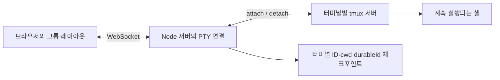

# 서버 재시작 이후에도 터미널 작업을 이어가기

## 문제와 재현 조건

터미널이 서버의 자식 PTY에만 연결되어 있으면 서버를 종료할 때 실행 중인 셸도 영향을 받는다. 같은 디렉터리에 새 터미널을 여는 것과 기존 프로세스를 유지하는 것은 다르다. 셸 변수나 진행 중인 프로그램은 새 셸에서 복구할 수 없다.

화면 복원에도 별도의 문제가 있다. 서버가 터미널 목록을 보내기 전에 클라이언트가 빈 목록을 저장하면 그룹이 사라질 수 있다. 서버가 첫 WebSocket 접속 전에 빈 체크포인트를 저장해도 기존 복원 정보가 소실된다.

재현 시나리오는 다음과 같다.

1. 등록된 프로젝트에 터미널 두 개를 열고 가로 그룹으로 묶는다.
2. 첫 터미널에서 하위 디렉터리로 이동하고 셸 변수를 설정한다.
3. Node 서버를 정상 종료한 다음 다시 시작하고 브라우저를 새로고침한다.
4. 같은 셸 변수와 작업 경로가 남아 있는지, 터미널 ID·순서·그룹·분할 배치가 유지되는지 확인한다.

## 선택한 설계



- **프로세스 수명:** [durable-terminal.js](../lib/durable-terminal.js)가 터미널별 tmux 소켓을 생성하고 기존 세션에는 다시 접속한다. 직접 프로세스 감독기를 작성하는 대신 tmux의 세션 유지 기능을 사용했다.
- **서버 체크포인트:** [server.js](../server.js)의 `terminalStateEntries()`가 실제 cwd와 durableId를 저장한다. `saveTerminalStateNow()`는 임시 파일에 쓴 뒤 rename하고, 아직 복원을 시작하지 않은 상태에서는 기존 체크포인트를 보존한다.
- **복원 순서:** 첫 WebSocket 연결에서 `restoreTerminals()`가 저장 항목을 처리한다. 등록 정보가 일시적으로 없으면 복원을 유예하고 `flushDeferredTerminalRestores()`에서 재시도한다.
- **화면 상태:** [terminal.js](../js/terminal.js)의 `remapLayoutIds()`와 [state.js](../js/state.js)의 그룹·순서 remap이 서버에서 받은 ID 매핑을 적용한다. 그룹 조회 시에는 살아 있는 터미널만 반환하되 저장된 원본 그룹을 지우지 않는다.

## 대안과 비용

| 선택지 | 장점 | 제약 |
|---|---|---|
| cwd와 시작 명령만 저장 | 외부 세션 관리자 없이 새 셸을 열 수 있다. | 기존 프로세스와 셸 상태는 유지되지 않는다. |
| tmux 세션에 재접속 | 서버와 셸의 수명을 분리한다. | tmux 설치가 필요하고 Windows 네이티브에서는 적용되지 않는다. |
| 자체 세션 데몬 | 동작을 직접 제어할 수 있다. | 프로세스 관리·IPC·장애 복구의 구현과 운영 부담이 커진다. |

현재 구현은 Unix에서 tmux를 사용할 수 있을 때 프로세스를 유지한다. tmux가 없거나 `COCKPIT_DURABLE_TERMINALS=0`이면 일반 PTY로 동작한다. PC 재부팅·tmux 종료·사용자의 터미널 닫기는 이 기능의 보존 범위가 아니다. 화면 레이아웃은 해당 브라우저의 localStorage에 저장된다.

## 검증과 증거

```bash
npm test
npx playwright-core install chromium
npm run test:integration
```

[통합 검증 스크립트](../scripts/verify-portfolio.mjs)는 복사한 실제 서버 코드, 실제 node-pty·tmux, Chromium을 사용한다. HTTP와 WebSocket 응답을 모의 데이터로 대체하지 않는다. 테스트용 홈 조회, 데이터 디렉터리, 프로젝트, 셸 초기화 파일과 tmux 소켓은 개인 환경에서 분리한다.

검증은 재시작 후 `PORTFOLIO_MARKER`와 cwd를 셸에서 다시 출력한다. 이를 통해 동일 경로에 새 셸을 열어 놓고 성공으로 처리하는 오류를 막는다. 서버 체크포인트의 durableId와 클라이언트의 그룹·순서·분할 트리도 비교한다.

2026-09-08 재검증 결과는 [portfolio-checks.json](portfolio-checks.json)에 있다. 2026-09-07 촬영 당시의 결과는 [verification.json](media/verification.json), 화면은 [복원 후 터미널](media/restored-terminals.png)에서 확인할 수 있다. 기록된 복원 시간은 서버 정상 종료·기동·브라우저 재접속·출력 확인을 포함한 단일 로컬 실행 시간이다. 이전 버전과의 성능 비교나 서비스 수준 보장은 아니다.

현재 통합 검증은 정상 종료 이후의 복원을 다룬다. 강제 종료 직전 미저장 상태, OS 재부팅, Windows WebView2, 여러 브라우저 간 크기 소유권 경합은 별도 검증이 필요하다.
