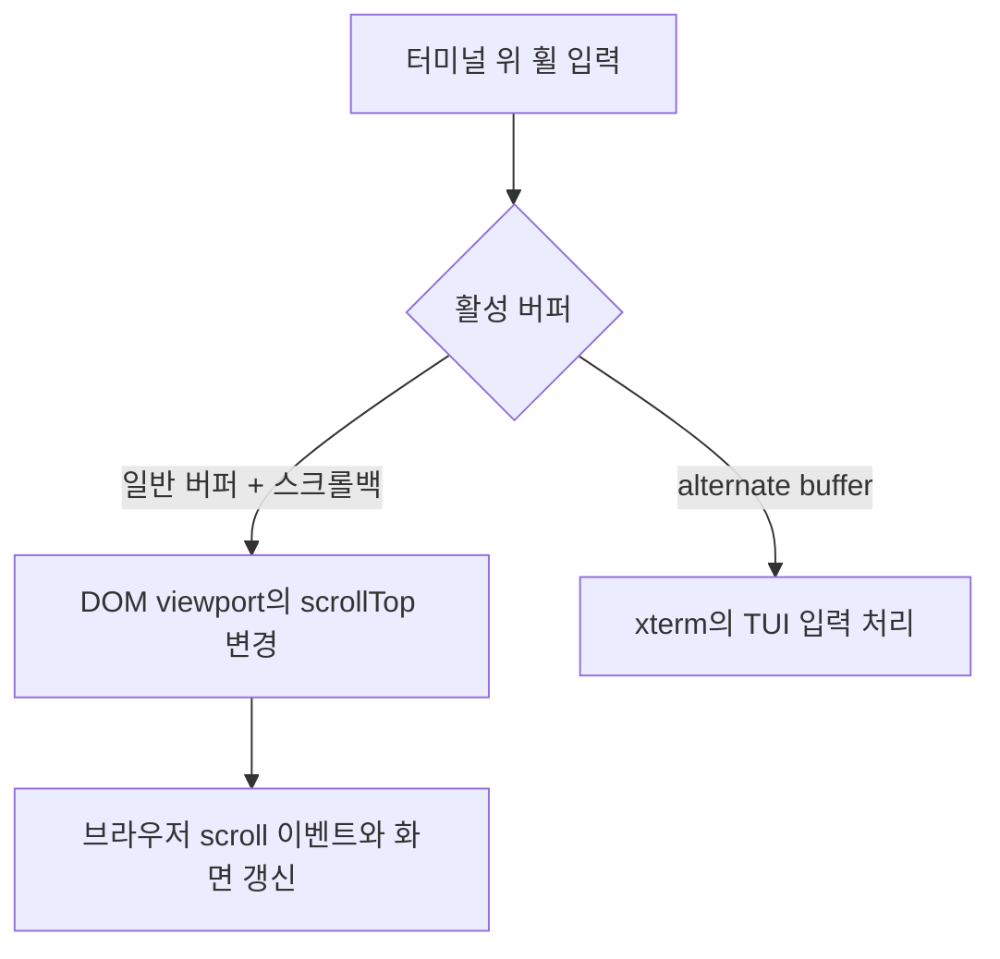

# 한글 입력과 터미널 스크롤 문제를 분리해서 해결하기

## 문제와 확인한 경로

터미널에서 “한글이 씹힌다”는 증상은 문자 전송 손실과 화면 셀 폭 오류를 모두 가리킬 수 있다. “휠이 안 된다”는 증상 역시 일반 셸의 스크롤백과 TUI의 마우스 입력 경로를 구분해야 한다.

저장소에는 한글 조합 전송, 실제 xterm 번들의 문자 폭, 터미널 휠 동작을 각각 검증하는 코드가 있다. 이 사례는 현재 코드와 회귀 검증을 근거로 작성했다. 과거 장애 당시의 입력 영상이나 수정 전 성능 수치가 있는 것으로 주장하지 않는다.

## 한글 조합: 전송 확정 시점을 보호하기

[xterm-ime-guard.js](../js/xterm-ime-guard.js)는 조합 중 keydown에서 강제로 문자열을 확정하지 않는다. 조합 종료 후 전달할 문자열을 큐에 넣고 다음 키 또는 예약된 콜백에서 전달한다. 이미 보낸 구간을 추적해 중복 전송을 막고, textarea 내용이 교체되는 경우 조합 종료 이벤트의 확정 문자열을 보조 근거로 사용한다.

패치는 xterm의 비공개 `_compositionHelper`에 의존한다. 따라서 필요한 필드·메서드와 쓰기 가능 여부를 확인하고 적용한다. 알려지지 않은 구조에는 적용을 거부하며, 적용 중 실패하면 원래 프로퍼티를 복구한다. 업스트림 수정이 모두 포함된 번들로 교체하면 제거해야 하는 호환성 코드다.

[IME 회귀 테스트](../tests/lib/xterm-ime-guard.test.js)는 조합 이벤트 순서·확정 문자열·중복 방지를 검증한다. 실제 Windows TSF나 macOS 입력기를 자동화한 테스트는 아니다.

## 문자 폭: 실제 번들로 렌더링 데이터 확인하기

[xterm-behavior.test.js](../tests/lib/xterm-behavior.test.js)는 jsdom에서 저장소의 실제 xterm 번들을 실행한다. 한글 음절이 너비 2인 셀과 너비 0인 연속 셀로 저장되는지, Unicode 11 애드온 적용 이후에도 같은지 확인한다. 일반 버퍼와 alternate buffer 전환도 확인한다.

이 테스트가 통과해도 GPU에서의 최종 글리프 모양이나 모든 OS 폰트 조합이 검증된 것은 아니다. 현재 [terminal-ui.js](../js/terminal-ui.js)는 캔버스 화면에서 WebGL을 사용하지 않고, 일반 화면에서도 명시적으로 켰을 때만 WebGL을 시도한다. WebGL이 항상 기본 렌더러라는 설명은 현재 구현과 맞지 않는다.

## 스크롤: 일반 셸과 TUI를 구분하기



[terminal.js](../js/terminal.js)의 휠 핸들러는 일반 버퍼에 스크롤백이 있을 때 실제 `.xterm-viewport`의 `scrollTop`을 변경한다. 캔버스 transform과 번들 조합에서 기존 스크롤 경로가 동작하지 않았던 경우를 처리하는 경로다. alternate buffer에서는 이 경로를 적용하지 않아 TUI가 입력을 받을 수 있게 한다.

입력 후 최신 출력을 따라가는 동작과 사용자가 과거 출력을 읽는 동작도 구분한다. 수동 휠 입력은 자동으로 맨 아래를 따라가는 임시 상태를 해제한다. 또한 숨겨진 브라우저 탭이 PTY 크기를 바꾸지 않도록 해 여러 화면의 크기 변경이 충돌하는 상황을 줄인다.

## 검증과 남은 범위

```bash
npm test
npm run test:integration
```

- 단위·번들 검증: 한글 조합 전송, 문자 셀 폭, 버퍼 전환, OSC 이벤트.
- Chromium 통합 검증: tmux 세션 복원을 검증한 뒤, tmux를 끈 별도의 일반 셸에서 300줄을 출력하고 실제 휠 이벤트 전후의 viewport 위치를 비교한다.
- 수동 검증: Windows WebView2의 실제 한글 입력, macOS 입력기, TUI별 마우스 모드, 터치패드, GPU 컨텍스트 손실.

[portfolio-checks.json](portfolio-checks.json)에 2026-09-08 재검증의 스크롤 위치와 브라우저 오류 수를 기록했다. [verification.json](media/verification.json)은 2026-09-07 화면·영상 촬영 당시의 별도 결과다. 위치 변화는 일반 버퍼 휠 경로의 동작 증거이며 입력 지연이나 FPS 개선 수치가 아니다. 번들 교체 시에는 [관리 절차와 수동 체크리스트](vendor-bundles.md)를 함께 따른다.
